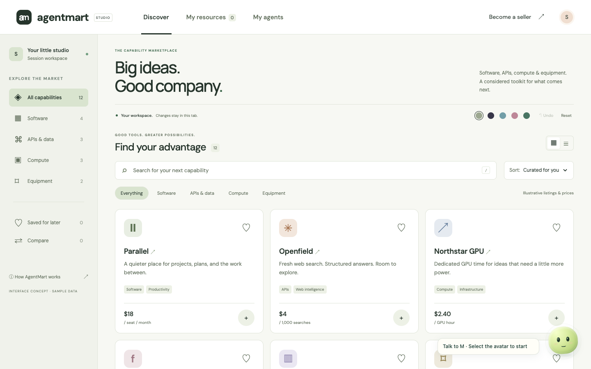
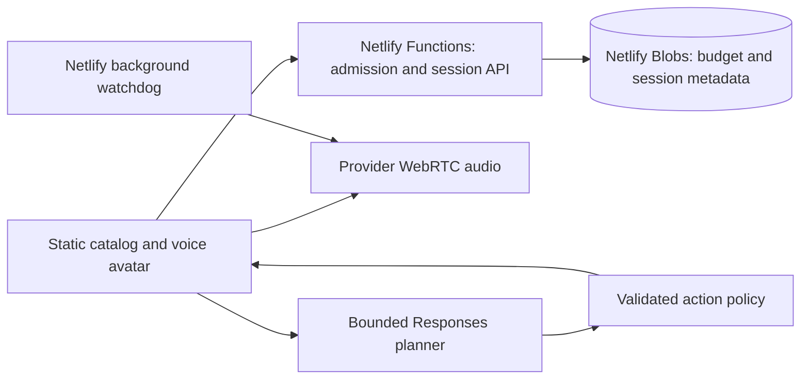
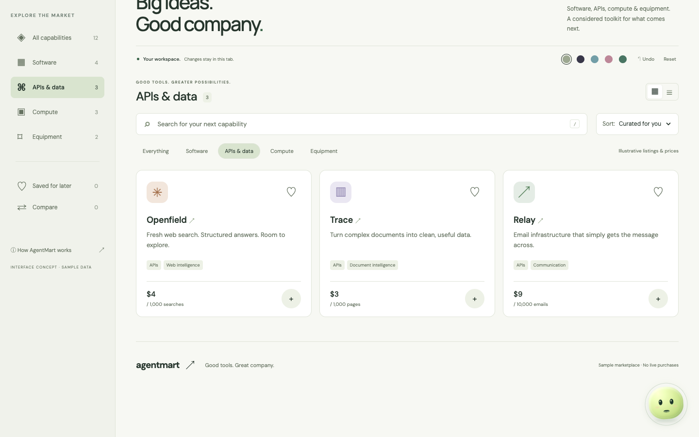

# AgentMart Studio

**A voice-guided marketplace experience with constrained actions and durable usage accounting.** Built by Shanto Mathew.

[Try the live experience](https://agentmart-live-shanto.netlify.app/) · [Explore the action policy](netlify/functions/policy.mts) · [Verification](docs/VERIFICATION.md)



*Actual production screenshot. All twelve products and prices are fictional. The voice guide is a real provider integration; purchases, agent budgets and seller submissions are local demonstrations.*

## Review it in two minutes

Browse the catalog, compare two products, or select **Talk to M** to start voice. Ask “Show me APIs,” then inspect the visible filter result. Click the active avatar to mute/unmute and press Escape to end. Opening the page does not request the microphone or start a paid session.

A September 14, 2026 production test sent synthetic speech through real WebRTC. The planner returned catalog navigation and an API filter; the actual page displayed **Openfield, Trace and Relay**, and the guide spoke about those results. Provider closure and ended audio tracks were verified. The catalog remains usable without voice availability.

## What I built

- **A complete product exploration flow:** search, categories, sorting, product details, saved items, two-item comparison, local acquisition review and seller preview.
- **A constrained voice action bridge:** bounded context and planner output become validated navigation, filters, themes and short visual effects. Model output cannot execute arbitrary code or publish changes.
- **An explicit voice lifecycle:** click-to-start, mute, reconnect, Escape/end, inactivity handling and server-side watchdog closure.
- **Conservative spend admission:** a durable ledger reserves capacity before sessions, uses atomic updates and retains uncertain usage rather than silently refunding it.

## Cloud and data architecture



The application is hosted on **Netlify**: static assets, TypeScript functions, a background watchdog and **Netlify Blobs**. It does not use an application-managed AWS database or commerce backend in this Studio variant.

| Data / responsibility | Implementation and lifetime |
| --- | --- |
| Admission ledger | [Budget module](netlify/functions/budget.mts): integer microdollars, strong reads and conditional writes preserve reservations across function invocations |
| Voice session records | [API](netlify/functions/api.mts) and [watchdog](netlify/functions/watchdog-background.mts): provider metadata, hashed capabilities, deadlines and closure/usage evidence |
| Catalog and acquisition preview | [Catalog UI](public/app.js): fictional records and local browser state, not an order database |
| Themes, guide context and undo | [Page bridge](public/site-guide.js): bounded visitor interface state with tab-scoped customization |
| Allowed model actions | [Policy validation](netlify/functions/policy.mts): trusted targets, explicit value limits and no executable model-supplied HTML/JavaScript |

The server ledger is durable; the marketplace demonstration is not a persistent multi-user account system. No real login, payment, subscription, seller submission, delivery or provisioning occurs here. Provider credentials remain server-side. Audio is sent to the provider while connected; no blanket zero-retention claim is made.

## Run locally

Use Node.js 22 and npm. These checks make no paid provider requests.

```sh
npm ci
npm run verify
python3 -m http.server 8080 --directory public
```

The static preview supports catalog controls. Live voice requires Netlify functions, your own provider access, a random watchdog secret and the correct HTTPS origin. [Setup and configuration](docs/SETUP.md) covers those requirements and the generic [.env.example](.env.example).

The existing public site uses a $14 AgentMart allocation within a $30 combined AgentMart/portfolio allowance. Availability changes with usage. These application reservations are not a provider invoice or account-wide hard cap. Do not reset its ledger, duplicate paid deployments to bypass the allowance or assume this approval applies to a new instance.

## Verified behavior

The release passed **48 local tests**, build/type checking and a zero-vulnerability production npm audit. Final production automation passed **18 grouped catalog checks** and **seven real voice checks**, including a visible spoken filter result, mute/unmute and provider/media shutdown. Desktop/mobile layouts and security headers were checked. Native Chrome separately exercised selected catalog workflows and the explicit-start state; it did not test physical-microphone speech accuracy. See [the dated evidence scope](docs/VERIFICATION.md).



The avatar responds to measured incoming audio energy, not phoneme-level lip synchronization. A ten-minute configured ceiling is not proof of a ten-minute tested conversation. This repository publishes reviewed personal Studio source and clean synthetic screenshots; the original private commerce repository and runtime records remain private.
