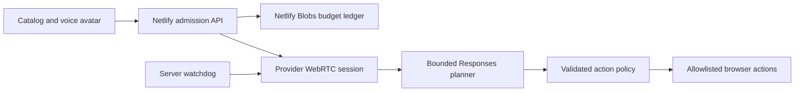

# AgentMart Studio

A voice-guided marketplace experience built by Shanto Mathew. Browse twelve fictional capabilities, compare two products, save a shortlist, explore local agent settings, and ask **M**, the voice guide, to navigate or change the interface.

[Open the public experience](https://agentmart-live-shanto.netlify.app/)

The catalog, prices, acquisitions, budgets and seller drafts are illustrative. The voice conversation and constrained page actions use a real provider when configured and admitted by the application budget. There are no actual purchases, payments, subscriptions, accounts, seller submissions, delivery or provisioning in this Studio experience.

## Try it

1. Search or filter the catalog and inspect a product.
2. Compare two capabilities or try the clearly labeled demo acquisition.
3. Select the small **Talk to M** avatar to start voice. Grant microphone permission if requested.
4. Ask “Show me APIs” or “Change the theme to rose” and inspect the resulting page change.
5. Click the active avatar to mute/unmute; press Escape to end the conversation.

Opening the page does not start a voice session. Voice requires supported browser audio, available provider access and sufficient application allowance. Catalog controls remain available if voice cannot start. Guide actions stay within this visitor's interface; the guide cannot edit source, deploy code or initiate commerce.

## Architecture



- `public/app.js`: fictional catalog, comparisons, local resources, agent settings and seller preview.
- `public/site-guide.js`: page context, validated UI actions, session customization and undo/reset.
- `public/voice.js`: explicit voice start, WebRTC lifecycle, avatar and browser audio cleanup.
- `netlify/functions/api.mts`: admission, bounded planner requests and capability-protected session operations.
- `netlify/functions/budget.mts`: atomic reservations and conservative settlement using integer microdollars.
- `netlify/functions/watchdog-background.mts`: authenticated sideband watchdog and provider closure.
- `netlify/functions/policy.mts`: validation of context, actions and capabilities.
- `site-context.json`: trusted fictional catalog descriptions; it is not live seller inventory.

The avatar responds to measured incoming audio energy. It is not phoneme-level lip synchronization. The planner cannot return executable HTML/JavaScript or arbitrary styling. State is local browser/session state, not a durable multi-user commerce database.

## Run and verify

Use Node.js 22 and npm.

```bash
npm ci
npm run verify
npm audit --omit=dev
```

These local checks do not make paid provider requests. For a static catalog preview without functions:

```bash
python3 -m http.server 8080 --directory public
```

The static preview supports catalog controls; voice requires the deployed Netlify functions and configuration.

To deploy your own instance, use this repository's `netlify.toml`: publish only `public/`, with `netlify/functions/` deployed as functions. Set your own `OPENAI_API_KEY`, random `WATCHDOG_SECRET` and exact HTTPS `SITE_ORIGIN` through protected runtime configuration. Never place values in public assets or source control. The source currently requests `gpt-live-1` for voice and `gpt-5.6-luna` for the planner; your provider account must support those interfaces.

The existing public site was authorized for a $14 AgentMart allocation within a combined $30 AgentMart/portfolio allowance. Current remaining availability is reported dynamically by `/api/health`; these are application reservations, not a provider invoice or account-wide hard cap. This source publication does not increase that allowance.

Review and explicitly authorize your own budget before enabling paid access. Budget settings are `LIVE_TOTAL_APPROVED_USD`, `LIVE_AGENTMART_BUDGET_USD` and `LIVE_PORTFOLIO_BUDGET_USD`. The validation supports fixed combined tiers and reserves development headroom. Do not reuse this project's approval as authorization for your own usage, reset an existing ledger, or create a fresh paid deployment to bypass existing reservations. Missing provider configuration leaves voice unavailable.

## Limits and provenance

This is a standalone publication of reviewed personal source, not the private AgentMart operational commerce repository or its history. The original private project remains separate. An application admission envelope is not a provider-account hard billing cap; unknown closure/usage retains conservative reservations. Current source allows a maximum ten-minute session with a three-minute inactivity cutoff. Browser, provider and network failures may end a session earlier. Short-call validation does not certify ten elapsed minutes of voice behavior.

The public experience includes a real voice integration and local marketplace demonstrations. Authentication, payment rails, subscriptions, shipping, provisioning and enterprise availability are outside this Studio's scope. Optional visual effects are temporary and respect reduced-motion preferences. Provider retention and account availability are governed by the provider; no blanket zero-retention claim is made.

[Verification record](docs/VERIFICATION.md) distinguishes local checks, fresh production browser evidence and historical voice testing. Screenshots should depict only fictional catalog state and synthetic test inputs.
